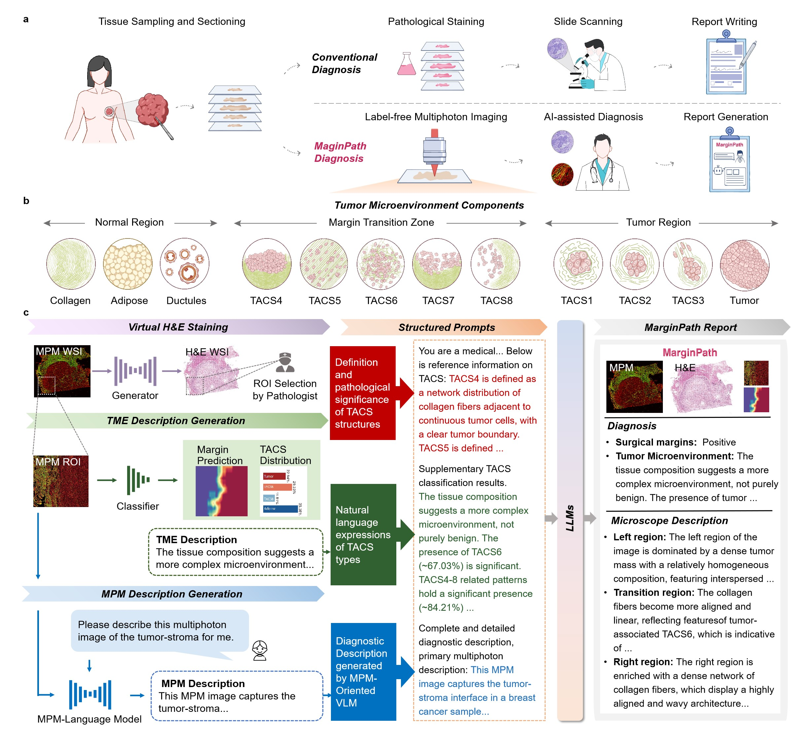

<div align="center"> 

# From Label-free Multiphoton Imaging to Pathological Reports: A Vision-Language Breast Cancer Margin Pathological Diagnosis System
</div>

<div align="center">
    <span class="author-block">
    Shu Wang<sup>1,2,3,#</sup>,</span>
    <span class="author-block">
    Jingze Su<sup>4,#</sup>,</span>
    <span class="author-block">
    Xiahui Han<sup>3,#</sup>,</span>
    <span class="author-block">
    Deyong Kang<sup>5,#</sup>,</span>
    <span class="author-block">
    Xiao Zhang<sup>4</sup>,</span>
    <span class="author-block">
    Fei Xu<sup>1</sup></span>
    <span class="author-block">
    Changzu Liu<sup>1</sup></span>
    <span class="author-block">
    Junlin Pan<sup>1</sup></span>
    <span class="author-block">
    Xingfu Wang<sup>6</sup></span>
    <span class="author-block">
    Qiaohui Zhan<sup>7</sup></span>
    <span class="author-block">
    Aimin Wang<sup>8</sup></span>
    <span class="author-block">
    Feng Huang<sup>1</sup></span>
    <span class="author-block">
    Heping Cheng<sup>2</sup></span>
    <span class="author-block">
    Wenxi Liu<sup>4,*</sup></span>
    <span class="author-block">
    Ruolan Lin<sup>9,*</sup></span>
    <span class="author-block">
    Jianxin Chen<sup>3,*</sup></span>
</div>
<div align="center">
    <p><sup>#</sup>Equal contribution. <sup>*</sup>Corresponding author.</p>
</div>

<br>

<div align="center">
    <sup>1</sup>
    School of Mechanical Engineering and Automation, Fuzhou University, Fuzhou 350108, China.&emsp;
    <br>
    <sup>2</sup> National Biomedical Imaging Center, College of Future Technology, Peking University, Beijing 100871, China.&emsp;
    <br>
    <sup>3</sup> Key Laboratory of OptoElectronic Science and Technology for Medicine of Ministry of Education, Fujian Provincial Key Laboratory of Photonics Technology, Fujian Normal University, Fuzhou 350007, China.&emsp;
    <br>
    <sup>4</sup> College of Computer and Data Science, Fuzhou University, Fuzhou 350108, China.&emsp;
    <br>
    <sup>5</sup> Department of Pathology, Fujian Medical University Union Hospital, Fuzhou 350001, China.&emsp;
        <br>
    <sup>6</sup> Department of Pathology, The First Affiliated Hospital of Fujian Medical University, Fuzhou 350005, China.&emsp;
        <br>
    <sup>7</sup> Department of Breast Surgery, The Second Affiliated Hospital of Xiamen Medical College, Xiamen 361000, China.&emsp;
        <br>
    <sup>8</sup> State Key Laboratory of Photonics and Communications, School of Electronics, Peking University, Beijing 100871, China.&emsp;
        <br>
    <sup>9</sup> Department of Radiology, Fujian Medical University Union Hospital, Fuzhou 350001, China. &emsp;
        <br>
</div>

# Abstract

Margin pathological assessment provides critical feedback for breast-conserving surgery, whereas H&E-stained histopathology focuses on residual tumor and may cause unnecessary resections. Label-free multiphoton microscopy (MPM) reveals tumor-associated collagen signatures (TACS) at the margin, offering a complementary diagnostic information. However, limited familiarity of novel MPM images by pathologists has prevented its integration into diagnostic workflows. Here, we introduce MarginPath, a Margin Pathological diagnosis system built on a MPM-language model that requires only a single label-free section. By integrating MPM-derived TACS with virtual H&E diagnostic criterion, MarginPath provide a multimodal diagnostic report, including: (i) a MPM image and corresponding virtual H&E image, (ii) a TACS-based pixel-level margin-status heatmap, and (iii) detailed natural-language diagnostic descriptions of tumor margin microenvironment. Validated on 158 invasive breast cancer specimens, MarginPath outperforms existing pathology vision-language models in margin diagnosis and can be extended into a question-answering system, enhancing both clinical decision-support and patient communication.

[//]: # (For more details, please check [our paper.]&#40;&#41;)

If you have any questions, please contact Shu Wang at [shu@fzu.edu.cn](shu@fzu.edu.cn) or Wenxi Liu at [wenxiliu@fzu.edu.cn](wenxiliu@fzu.edu.cn)



# Environment
```bash
pip install -r requirements.txt
```

# Raw Image Data
Due to data privacy requirements, we are preparing the test data and will make it available as soon as we can.
Available on Google Drive:
- [Virtual H&E Whole Slide Image (WSI)]((https://drive.google.com/drive/folders/1kc0nXIN9KC_rORhHLTc-CDa-lEl9ZE3r?usp=drive_link))
- [MPM Regions of Interest (ROI)](https://drive.google.com/drive/folders/12ExaGtcZnqdCu4em_CbXG8bxUwGlRPZ_?usp=drive_link)

# Our Trained Models
Download the following models trained specifically for this pipeline:
- [Virtual H&E Staining Model](https://drive.google.com/drive/folders/1thA3yZjIwpYM0lsinprXzYf-56GBIDi9?usp=drive_link)
- [ViT Classifier (Tumor Margin Visualization)](https://drive.google.com/drive/folders/19wQxxKxs0eQ32ClJRPL31Ct4tXsggHPv?usp=drive_link)
- [MPM-Language Model (MPM Image Description Generation)](https://drive.google.com/file/d/1ce4jh6rGRzBG1y2DraFNdMHRIJNMe2os/view?usp=drive_link)

# MarginPath Report
To generate pathological reports from MPM images, please run the following commands:

### 1. Virtual H&E Staining Generation
Convert MPM WSIs to virtual H&E stained images:
```bash
python Stain/test.py \
  --dataroot /path/to/mpm/data/ \
  --name HE_cyclegan_pretrained \
  --model test \
  --results_dir /path/to/output/results/
```
After generation, select regions of interest (ROI) within the virtual H&E images to generate corresponding pathological reports.

### 2. Tumor Margin Visualization
Predict tumor margins using the trained ViT classifier:
```bash
# adjust relevant configurations at line 27 in Classifier/infer_large.py before execution.
python Classifier/infer_large.py
```


### 3. MPM Image Description Generation
Generate textual descriptions for input MPM images via MPM-Language Model:
```bash
# adjust relevant configurations at line 13 in Report/test_batch.py before execution.
python Report/test_batch.py
```
Results will be saved to `xx/test_results.json`.

### 4. Complete Pathological Report Generation
Integrate all modules to produce final pathological reports:
```bash
# adjust relevant configurations at line 495 in Report/qwen2vl_reinforce.py before execution.
python Report/qwen2vl_reinforce.py
```

# Model Training
## MPM-to-H&E virtual staining Model Training
<b>Environment Requirements:</b>
- Linux: Ubuntu 23.1
- Python 3.7 + Pytorch 1.8.1
- NVIDIA GPU + CUDA 12.1

Training command:
```bash
python Stain/train.py \
  --dataroot /path/to/training/data/ \
  --name HE_cyclegan_pretrained \
  --model cycle_gan
```

## MPM-Language Model Training
<b>Environment Requirements:</b>
- Linux: Ubuntu 22.04
- Python 3.12 + Pytorch 2.5.1 
- NVIDIA GPU + CUDA 12.4

<b>Preparation:</b>
- Download [Qwen2-VL-2B-Instruct](https://huggingface.co/Qwen/Qwen2-VL-2B-Instruct/tree/main) weights
- Set the pretrained model path at line 21 in Report/finetune_qwen2vl.py

Training command:
```bash
python Report/finetune_qwen2vl.py
```
